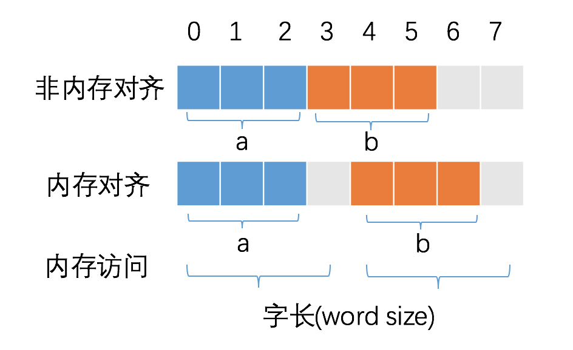

# 内存对齐
CPU 访问内存时，并不是逐个字节访问，而是以字长（word size）为单位访问。比如 32 位的 CPU ，字长为 4 字节，那么 CPU 访问内存的单位也是 4 字节。

这么设计的目的，是减少 CPU 访问内存的次数，加大 CPU 访问内存的吞吐量。比如同样读取 8 个字节的数据，一次读取 4 个字节那么只需要读取 2 次。

CPU 始终以字长访问内存，如果不进行内存对齐，很可能增加 CPU 访问内存的次数，例如：

变量 a、b 各占据 3 字节的空间，内存对齐后，a、b 占据 4 字节空间，CPU 读取 b 变量的值只需要进行一次内存访问。如果不进行内存对齐，CPU 读取 b 变量的值需要进行 2 次内存访问。第一次访问得到 b 变量的第 1 个字节，第二次访问得到 b 变量的后两个字节。

从这个例子中也可以看到，内存对齐对实现变量的原子性操作也是有好处的，每次内存访问是原子的，如果变量的大小不超过字长，那么内存对齐后，对该变量的访问就是原子的，这个特性在并发场景下至关重要。

简言之：合理的内存对齐可以提高内存读写的性能，并且便于实现变量操作的原子性。